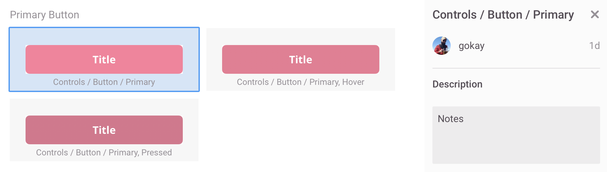

# Getting Started

## 1. Prepare configuration file

First we'll create a JSON configuration file in our repository that maps components in that codebase to the components in Zeplin.

Configuration file preparation:
- Use [Zeplin Visual Studio Code extension]() _(Recommended)_
- Manual

In this guide, we'll prepare the file **manually**, while also mentioning how you can use the extension to simplify all of the steps.

### Create configuration file

We recommend creating your Zeplin configuration file under the `.zeplin` folder in your repository, so let's create that folder first. Within the folder, also create a file called `components.json` and paste the JSON below:

```json
{
    "projects": [],
    "styleguides": [],
    "components": []
}
```

If you use the Visual Studio Code extension, it will prompt you to create the configuration file. You can also use “Command/Ctrl + Shift + P” and select the “Create Zeplin Configuration File” command. After creating the configuration file, make sure to click the “Login” link on top of the file to authenticate with your Zeplin account.

### Add projects or styleguides

Let's start filling out the configuration file:

- `projects` and `styleguides` keys are the identifiers of Zeplin projects and styleguides we'll use components from.
- `components` are the component files in our codebase.

If you're using [Global Styleguides](https://blog.zeplin.io/announcing-global-styleguides-connecting-design-systems-to-engineering-65ad22bd0076), adding your styleguide(s) will be enough. If instead your components are under projects, you can add all your projects as well. In this example, we'll only add one styleguide.

To add projects or styleguides, we need their identifiers. If you're not using the Visual Studio Code extension, the easiest way to find the identifier of a Zeplin project or a styleguide is to open them in Zeplin's [Web app](https://app.zeplin.io). Look for the URL in the address bar, which should look like so: `https://app.zeplin.io/styleguide/5cd486b18a64c1414be004fb`. The identifier after `styleguide/` (or `project/`) is the identifier we're looking for.

If you're using the Visual Studio Code extension, simply click “Add styleguide” or “Add project” and you'll be presented with a list.

After adding projects or styleguides to our configuration file, it should look like so:

```json
{
    "projects": [],
    "styleguides": [
        "5cd486b18a64c1414be004fb"
    ],
    "components": []
}
```

☝️ _If you have a styleguide tree and want to connect to all the components in the tree, adding a child styleguide to the configuration should be enough._

### Add component from codebase

Adding a component from your codebase to the configuration file is pretty straightforward—we'll add an object to the `components` list.

In this example, we'll add a React file but you can add any file that represents your component based on your platform/framework. Let's update our configuration file to look like so:

```json
{
    "projects": [],
    "styleguides": [
        "5cd486b18a64c1414be004fb"
    ],
    "components": [
        {
            "path": "src/components/Button.jsx",
            "zeplinNames": []
        }
    ]
}
```

If you're using the Visual Studio Code extension, click the “Add component” link which will list all the files in your repository. Pick the one you want and your configuration file should look like above.

Next up, we'll populate the `zeplinNames` key.

### Connect to component from Zeplin

Now it's time to connect the component we just added, to a component in Zeplin. We'll do that by adding the name of the component to the `zeplinNames` list.

Let's open the styleguide (or the project) we added and copy the name of the component in Zeplin. In our example, our component's name is “Controls / Button / Primary”. Here's how it looks like in Zeplin:



Let's add this name to the `zeplinNames` list:

```json
{
    "projects": [],
    "styleguides": [
        "5cd486b18a64c1414be004fb"
    ],
    "components": [
        {
            "path": "src/components/Button/Button.js",
            "zeplinNames": [
                "Controls / Button / Primary"
            ]
        }
    ]
}
```

Notice that in the screenshot above, we have two more states of the same button. It's possible connect a component in our codebase to multiple components in Zeplin. Here's how that would look like:

```json
…
            "zeplinNames": [
                "Controls / Button / Primary",
                "Controls / Button / Primary, Hover",
                "Controls / Button / Primary, Pressed"
            ]
…
```

If you're using the Visual Studio Code extension, you can simply click “Connect to Zeplin component” and search for a component in Zeplin, directly within Visual Studio Code.

**Congratulations, we just connected our first component!** 🎉

Next up, we'll install and use Zeplin's CLI tool so that these connected components are visible in Zeplin to our team.

## 2. Install Zeplin CLI

Zeplin CLI runs in your terminal and communicates the configuration file with Zeplin.

Let's start by installing it. Zeplin CLI runs on Node.js, if you don't have it installed already, see [Node.js website](https://nodejs.org/en/).

To install Zeplin CLI from npm, run the following command on your Terminal/Command Prompt:

```sh
npm install -g @zeplin/cli
```

Alternatively, if you're using npm in your project, you can add `@zeplin/cli` as a `devDependency`.

## 3. Choose which CLI plugins to use

Zeplin CLI uses plugins to generate documentation, snippets and links from components. Check out our [list of plugins](README.md#Plugins) and pick the ones you want to use, based on your platform, framework or tools.

In this example, we'll use two plugins:

1. React plugin to generate documentation and snippets from components
2. Storybook plugin to generate Storybook links of components

First of all, let's install these plugins plugins from npm, by running the following command:

```sh
npm install -g @zeplin/cli-connect-react-plugin @zeplin/cli-connect-storybook-plugin
```

Now, we'll update our configuration file to use these plugins. We can do so by adding them under the `plugins` list, like so:

```json
{
    "plugins": [
        {
            "name": "@zeplin/cli-connect-react-plugin"
        },
        {
            "name": "@zeplin/cli-connect-storybook-plugin",
            "config": {
                "url": "http://localhost:9009",
                "startScript": "storybook"
            }
        }
    ],
    "projects": [],
    "styleguides": [
        "5cd486b18a64c1414be004fb"
    ],
    "components": [
        {
            "path": "src/components/Button/Button.js",
            "zeplinNames": [
                "Controls / Button / Primary"
            ]
        }
    ]
}
```

☝️ _It is possible to use Zeplin CLI without any plugins but the plugins will drastically improve the amount of information your team will have access to in Zeplin._

Before we run the Zeplin CLI tool, we have an optional step that lets you display various links for each component, e.g. to your internal Wiki, GitHub repository and so on.

## 4. Add links _(Optional)_

We'll now add links to our components to be displayed within Zeplin. Components can be linked to any website, including your internal wiki, public Design System website and so on.

There are also predefined links that Zeplin supports, like GitHub, which can be added really simply. Let's add the `github` key to our configuration file, like so:

```json
    {
        "plugins": [
            {
                "name": "@zeplin/cli-connect-react-plugin"
            },
            {
                "name": "@zeplin/cli-connect-storybook-plugin",
                "config": {
                    "url": "http://localhost:9009",
                    "startScript": "storybook"
                }
            }
        ],
        "projects": [],
        "styleguides": [
            "5cd486b18a64c1414be004fb"
        ],
        "components": [
            {
                "path": "src/components/Button/Button.js",
                "zeplinNames": [
                    "Controls / Button / Primary"
                ]
            }
        ],
        "github": {
            "repository": "example/react-components"
        }
    }
```

By just adding this one line, Zeplin will now display links to the source code in GitHub for each component.

☝️ _To learn more about how to add custom links, check out our [Configuration file documentation](CONFIGURATION_FILE.md)._

## 5. Run Zeplin CLI

It's time! Let's **run the CLI tool and see Connected Components in action** within Zeplin. 🎉

Run the following command—if it's your first time, you'll need to login to Zeplin first:

```sh
zeplin connect
```

Now head back to Zeplin and click on one of the components you connected. You should be able to see an output like so:


Hope this Getting Started guide was helpful, reach out to us at [support@zeplin.io](mailto:support@zeplin.io) if you have any questions or feedback.

For further details on how to customize the configuration file, check out the [Configuration file documentation](CONFIGURATION_FILE.md).

# Troubleshooting

If you run into any issues while running the `zeplin connect` command, make sure that you have all the plugins installed. All [plugins](README.md#Plugins) have installation instructions within their repositories.

# Related resources
- [Configuration file documentation](CONFIGURATION_FILE.md)
- [Plugins](README.md#Plugins)
- [Build your own plugin](https://github.com/zeplin/cli/blob/master/PLUGIN.md)
