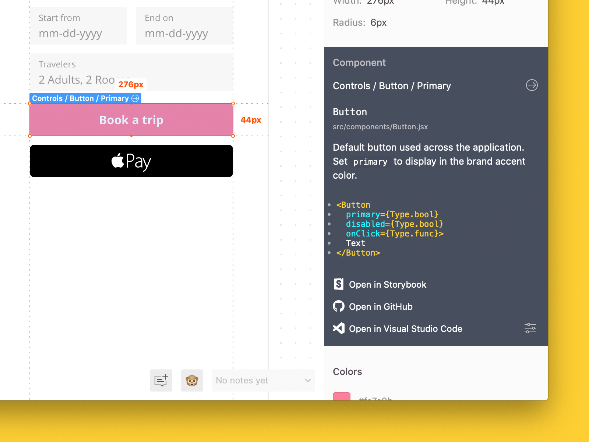

# Zeplin Connected Components Documentation 🧩

In Zeplin, Connected Components enables developers to access component code directly on the designs––in addition you can include a pathway to Storybook, GitHub, your design system or any other source of documentation.

After connecting your components in Zeplin to your components in code, you'll get a high level overview of the component right on the designs, like so:

## Getting started

For details on how to use Connected Components in Zeplin, check out our [Getting Started documentation](GETTING_STARTED.md).

## Configuration file documentation

For details on how to work with the `.zeplin/components.json` configuration file, check out the [Configuration file documentation](CONFIGURATION_FILE.md).

## Plugins

Connected Components is built with modularity and extensibility in mind. Plugins generate documentation, code snippets and links to be displayed in Zeplin—**pick and choose the plugins you need based on the framework, platform and tools you prefer**.

| Name                                                                       | Description                                                      | Created by                                                                         |
|----------------------------------------------------------------------------|------------------------------------------------------------------|------------------------------------------------------------------------------------|
| [Angular Plugin](https://github.com/zeplin/cli-connect-angular-plugin)         | Generates Angular documentation, snippets from components          | [zeplin](https://github.com/zeplin)                                                |
| [React Plugin](https://github.com/zeplin/cli-connect-react-plugin)     | Generates React documentation, snippets from components        | [zeplin](https://github.com/zeplin)                                                |
| [Swift Plugin](https://github.com/zeplin/cli-connect-swift-plugin)         | Generates documentation, snippets from iOS, macOS views in Swift | [zeplin](https://github.com/zeplin)                                                |
| [Storybook Plugin](https://github.com/zeplin/cli-connect-storybook-plugin) | Generates Storybook links of components                          | [zeplin](https://github.com/zeplin), [storybookjs](https://github.com/storybookjs) |
| [Vue Plugin](https://github.com/politico/zeplin-cli-connect-plugin-vue)    | Generates Vue snippets from components                           | [politico](https://github.com/politico)                                            |

**To build your own plugin** (either for internal use or sharing publicly), check out our [CLI plugins documentation](https://github.com/zeplin/cli/blob/master/PLUGIN.md).

☝️ *It is possible to use Connected Components without any plugins and still display links to your internal wiki or your repository.*

## Need help?

Reach out to us at [support@zeplin.io](mailto:support@zeplin.io) if you have any questions or feedback.
