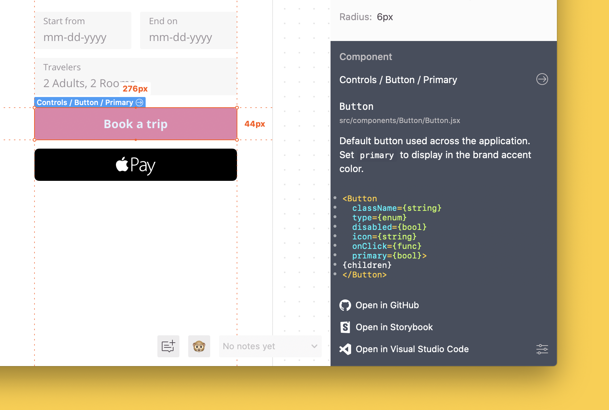

# Zeplin Connected Components Documentation 🧩

Connected Components in Zeplin enables developers to access components in their codebase right on the designs—with links to Storybook, GitHub and any other source of documentation based on your workflow.

After connecting your components in Zeplin to your components in code, you'll be able to get a high level overview of the component right on the designs, like so:

## Getting started

To get started, check out the quick start guide:

- [Quick start guide](docs/gettingStarted/QUICK_START.md)

For more details, see our manual configuration guides for specific frameworks/platforms:

- [React](docs/gettingStarted/REACT.md)
- [Vue.js](docs/gettingStarted/VUE.md)
- [Angular](docs/gettingStarted/ANGULAR.md)
- [iOS/macOS with Swift](docs/gettingStarted/SWIFT.md)

Once you connect your components, check out these follow-up guides:

- [Adding repository links](docs/link/REPOSITORY.md), e.g. GitHub, GitLab, Bitbucket
- [Adding custom links](docs/link/CUSTOM.md), e.g. internal Design System wiki
- [Adding Storybook links](docs/link/STORYBOOK.md)
- [Adding Styleguidist links](docs/link/STYLEGUIDIST.md)
- [Test your changes locally](docs/gettingStarted/TEST_LOCALLY.md)

Other related documents:

- [Authentication](docs/AUTHENTICATION.md)
- [Troubleshooting](docs/TROUBLESHOOTING.md)
- [Configuration file details](docs/CONFIGURATION_FILE.md)

## Plugins

Connected Components is built with modularity and extensibility in mind. Plugins generate documentation, code snippets, links and so on to be displayed in Zeplin—**pick and choose the plugins you need based on the language, platform and tools you prefer**.

| Name | Description | Created by |
| --- | --- | --- |
| [React Plugin](https://github.com/zeplin/cli-connect-react-plugin) | Generates documentation, snippets for React and React Native components | [zeplin](https://github.com/zeplin) |
| [Angular Plugin](https://github.com/zeplin/cli-connect-angular-plugin) | Generates documentation, snippets for Angular components | [zeplin](https://github.com/zeplin) |
| [Swift Plugin](https://github.com/zeplin/cli-connect-swift-plugin) | Generates documentation, snippets for iOS, macOS views in Swift | [zeplin](https://github.com/zeplin) |
| [Storybook Plugin](https://github.com/zeplin/cli-connect-storybook-plugin) | Generates Storybook links for components | [zeplin](https://github.com/zeplin), [storybookjs](https://github.com/storybookjs) |
| [Vue Plugin](https://github.com/politico/zeplin-cli-connect-plugin-vue) | Generates documentation, snippets for Vue components | [politico](https://github.com/politico) |
| [StencilJS Plugin](https://github.com/fmontes/zeplin-cli-connect-plugin-stenciljs) | Generates documentation, snippets for StencilJS Web Components | [fmontes](https://github.com/fmontes) |

**To build your own plugin** (either for internal use or sharing publicly), check out our [CLI plugins documentation](https://github.com/zeplin/cli/blob/master/PLUGIN.md).

☝️ *It is possible to use Connected Components without any plugins and still display links to your internal wiki or your repository.*

## Need help?

Reach out to us at [support@zeplin.io](mailto:support@zeplin.io) if you have any questions or feedback.
