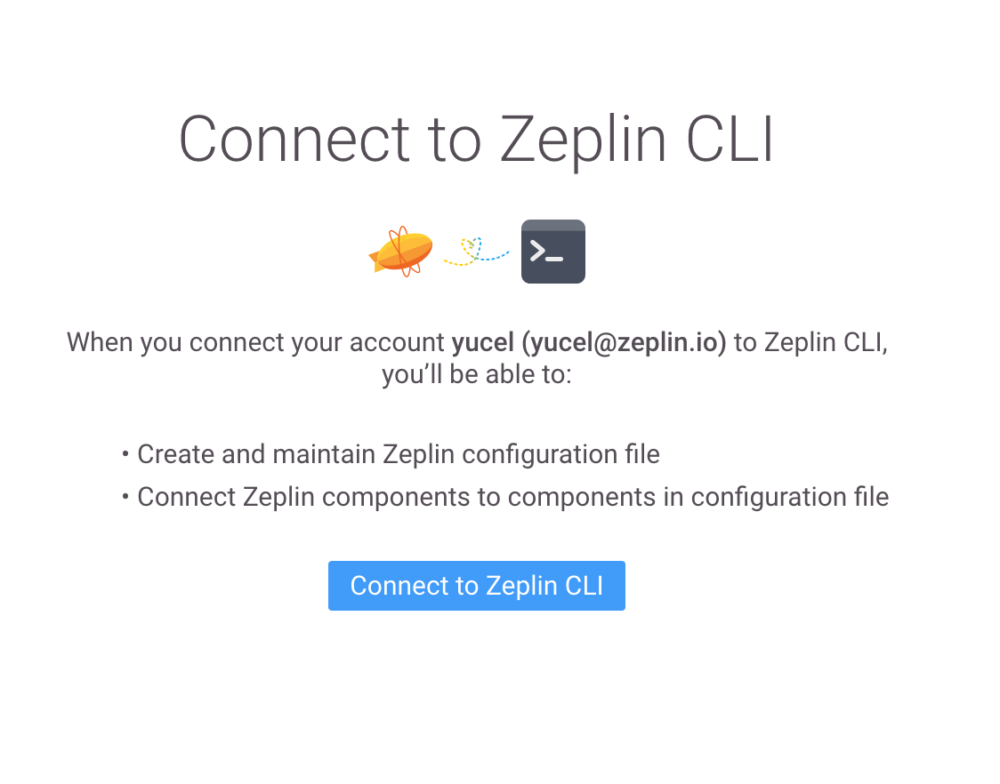

### Table of Contents
- [Authentication](#authentication)
  * [Authentication using existing browser session](#authentication-using-existing-browser-session)
  * [Authentication using environment variable](#authentication-using-environment-variable)
  * [Authentication with credentials](#authentication-with-credentials)
  * [Switching to other Zeplin accounts](#switching-to-other-zeplin-accounts)

# Authentication

In this guide, we'll talk about how to authenticate with Zeplin CLI.

CLI commands will start authentication flow if the command requires so, otherwise you can use `zeplin login` command to authenticate without taking any action. There are 3 methods to authenticate.

## Using existing browser session

This is the default authentication flow.

1. Run the following command on terminal.
```
zeplin login
```
By default, Zeplin CLI will open a browser to use the existing Zeplin session. If you are not already logged into the web app, you will be asked to login using your Zeplin credentials or an SSO provider.

2. The opened page in browser will be like the below example. Click on `Connect to Zeplin CLI`.
3. Go back to the terminal. CLI will automatically capture the created token and save it. If it does not respond, copy token shown on the authentication page and paste it to the terminal prompt to proceed.

## Using environment variable

Zeplin CLI can authenticate using an access token instead of your Zeplin credentials which makes it easier to integrate it into your CI workflow.

1. Get a CLI access token from your [Profile](https://app.zeplin.io/profile/connected-apps) in Zeplin. If a CLI token already exists, you should first revoke the existing and then generate a new one.
2. Set `ZEPLIN_ACCESS_TOKEN` environment variable in your CI pipeline.

CLI will try to validate the token on any action that require authentication, if the token is valid the action will halt with authentication error.

You must unset the environment variable to login using other methods.

## Using account credentials

You can also use Zeplin username/password to authenticate CLI.

1. Run the following command on terminal.
```
zeplin login --no-browser
```
2. Type in username and password of the Zeplin account.
3. CLI will save the token for later usage.

## Switching to other Zeplin accounts

Run `zeplin login` again to authenticate with another Zeplin account.

Please note that the default login flow will automatically use the existing Zeplin session on your browser. You should first login with the other account on web app or use [Authentication with credentials](#authentication-with-credentials) method to use other account's credentials.
