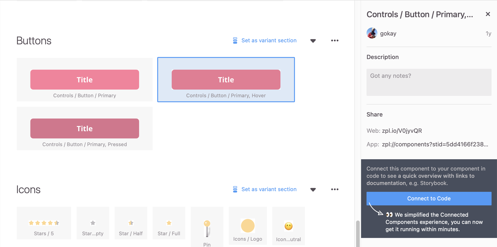
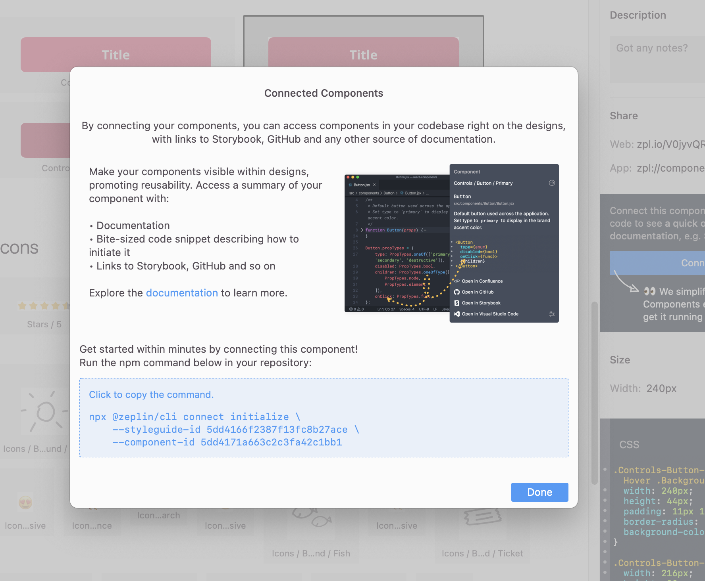
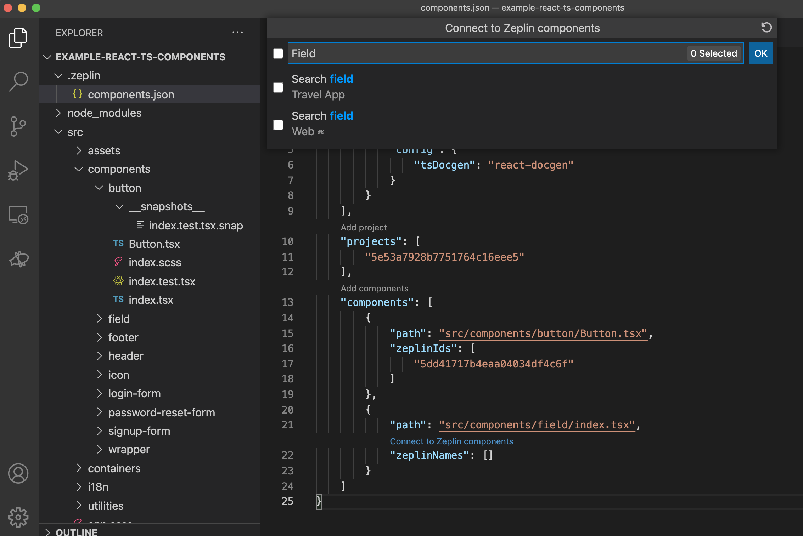

### Table of Contents
- [Connected Components Quick Start Guide](#getting-started-with-connected-components)
  * [Table of Contents](#table-of-contents)
  * [Requirements](#requirements)
  * [Connecting the first component](#connecting-the-first-component)
    + [Project types](#project-types)
  * [Inspect the configuration file](#inspect-the-configuration-file)
  * [Update Connected Components](#update-connected-components)
  * [Connecting more components](#connecting-more-components)
    + [Using CLI command](#using-cli-command)
    + [Using VS Code Extension](#using-vs-code-extension)
  * [Add links (Optional)](#add-links-optional)
- [Troubleshooting](#troubleshooting)

# Connected Components Quick Start Guide

This guide covers how to get started with Connected Components for React, Angular, Vue.js interactively.

## Requirements

[node 10+](https://docs.npmjs.com/downloading-and-installing-node-js-and-npm) must be installed on your system.

## Connecting your first component

In Zeplin, navigate to the Components page of a styleguide or project and select a component to connect.



We'll now click on _Connect to Code_ button on the right panel. Zeplin will display a command  to connect this component. While `--project-id <projectId>` or `--styleguide-id <styleguideId>` parameters are based on the project/styleguide we're in, `--component-id <componentId>` represents the component we have selected.

Click on the command and it will be copied it to your clipboard.



We'll now open the Terminal app and navigate to the folder where source code is, then paste and execute the command.

```sh
npx @zeplin/cli connect initialize \
    --project-id 5e53a7928b7751764c16eee5 \
    --component-id 5dd417142dff493fc295dda1
```

We'll now simply follow the instructions. Initially, CLI will ask you to authenticate. Once you're logged in, CLI should ask you to select the component file in your codebase to connect to. Once you do, the configuration file (`.zeplin/components.json`) will be created and required packages will be installed.


**Voilà, we just connected our first component!** 🎉

Now let's head back to Zeplin and check out the component! Based on the project type, the component may have a description and code snippet that should look like this:


### Project types

The initialize command we just ran detects your project type and installs related CLI plugins. As of now, the following project types are supported:
 - [React](https://github.com/zeplin/cli-connect-react-plugin)
 - [Angular](https://github.com/zeplin/cli-connect-angular-plugin)
 - [Vue.js](https://github.com/johntips/storybook-vue-zeplin)
 - [Storybook](https://github.com/zeplin/cli-connect-storybook-plugin)

 If necessary, check out the links for plugins more configuration details.

## Inspect the configuration file

As mentioned above, the initialize command creates a configuration file—let's see how it looks like. Open the new `.zeplin/components.json` file in your repository. It should look similar to this:

```json
{
    "plugins": [
        {
            "name": "@zeplin/cli-connect-react-plugin"
        },
        {
            "name": "@zeplin/cli-connect-storybook-plugin",
            "config": {
                "url": "http://localhost:9009",
                "startScript": "storybook"
            }
        }
    ],
    "projects": [
        "5e53a7928b7751764c16eee5"
    ],
    "components": [
        {
            "path": "src/components/button/Button.jsx",
            "zeplinIds": [
                "5dd41717b4eaa04034df4c6f"
            ]
        }
    ]
}
```

- `projects` and `styleguides` keys are the identifiers of projects and styleguides we'll connect components from.
- `plugins` contain the module name of the plugins that the CLI uses to process our components. Each plugin may have its own custom configuration under `config` key.
- `components` are the component files in our codebase. `zeplinIds` are the component IDs in Zeplin that the component connect to. You can alternatively use the `zeplinNames` key (instead of `zeplinIds`) to connect components using their names in Zeplin.

Check [CONFIGURATION_FILE.md](../CONFIGURATION_FILE.md) for more details.

## Update Connected Components

Executing `zeplin connect` (or `npm run zeplin-connect` if Zeplin CLI packages are installed locally) will process the configuration/component files again, and update our Connected Components in Zeplin.

You can add a task into your CI/CD pipeline to update Connected Components every time your component source code changes.

## Connecting more components

After initializing Connected Components, you can use the `zeplin connect add-components` (or `npm run zeplin-connect add-components` if Zeplin CLI packages are installed locally) command to connect more components to Zeplin interactively.

It is possible to add components from other Zeplin projects or styleguides into the same configuration file. If you're using [Global Styleguides](https://blog.zeplin.io/announcing-global-styleguides-connecting-design-systems-to-engineering-65ad22bd0076), adding your components using the IDs of styleguide(s) will be enough. Connected Components will show up on parent Zeplin styleguide(s) as well.

### Using CLI

Open Zeplin and select another component that is not connected yet. Click on the _Connect to Code_ button again. This time, Zeplin will display the command to add this component to the existing Connected Component configuration. (Notice that the only difference is the `add-components` parameter, instead of `initialize`.)

Similary, paste and execute the command. This component will now be added to the configuration file as well.

```sh
npx @zeplin/cli connect add-components \
    --project-id 5e53a7928b7751764c16eee5 \
    --component-id 5dd417142dff493fc295dce5
```

Rinse and repeat until you're done connecting all the component you need to!

_Using `initialize` command will fallback to `add-components` if you have an existing `.zeplin/components.json` and vice versa._

### Using VS Code extension

You can also use the [Zeplin Visual Studio Code extension](https://zpl.io/vscode-extension) to manage the `.zeplin/components.json` file. It simplifies adding more and managing components in the configuration file.

- Open the configuration file in VS Code and notice that there are links on top of the various fields:

- Click the _Add component_ link which will list all the files in your repository, and then select the file. The component you select will be added to the configuration file.
- Click _Connect to Zeplin component_ on component you just added and the extension will list all the components in your project or styleguide in Zeplin. Search for the component by its name (select multiple components if necessary) and connect them!


## Add links (Optional)

Connected Components also lets you add links to various sources like your Storybook, repository, wiki and so on. In the screenshot above, notice that we have links to GitHub and Storybook.

Zeplin CLI will try to configure Storybook and git repository links automatically. If you don't see those links, check out these guides to add them:

- [Adding Storybook links](../link/STORYBOOK.md)
- [Adding Styleguidist links](../link/STYLEGUIDIST.md)
- [Adding repository links](../link/REPOSITORY.md), e.g. GitHub, GitLab, Bitbucket
- [Adding custom links](../link/CUSTOM.md), e.g. internal Design System wiki

# Troubleshooting

Check [Troubleshooting](../TROUBLESHOOTING.md) document for common issues.
