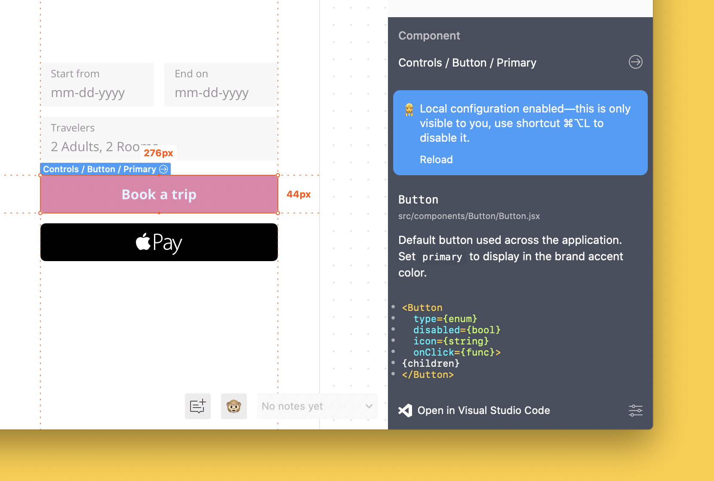

# Test your changes locally

In this guide, we'll talk about how to test your changes locally before publishing them to Zeplin. This lets you see a preview of your changes in Zeplin and review them before sharing with everyone in your team.

☝️ _If you haven't connected your components yet, check out our [getting started guides](/README.md#getting-started) first._

When you run the CLI command `zeplin connect`, your changes are published to Zeplin for everyone to see.

Let's run the command with the `--dev` flag to see the changes in our configuration locally, like so:

```sh
zeplin connect --dev
```

Now we'll head back to Zeplin and use the shortcut **“Command/Ctrl + Option/Alt + L”** to enable local configuration. Once you press the shortcut, you should see a message appear confirming that you enabled local configuration.

☝️ _Alternatively in the desktop apps, you can select “Developer > Connected Components > Enable Local Configuration” from the menu up top._

Let's select one of the components we connected previously. This is what we should see:



Now when we change the configuration file (or the component itself) we should see the changes in Zeplin when we click “Reload”.

When you're ready to publish the changes to everyone in your team, run the CLI command without the flag like so:

```sh
zeplin connect
```

Hope this quick guide on testing your changes locally was helpful, reach out to us at [support@zeplin.io](mailto:support@zeplin.io) if you have questions or feedback.
