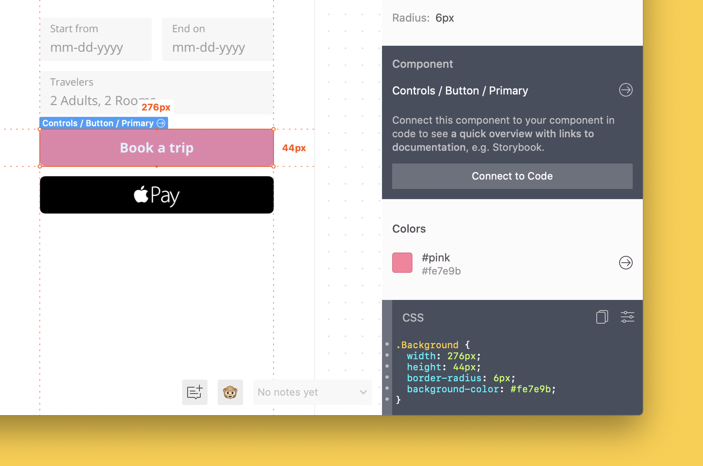

# Test your changes locally

In this guide, we'll talk about how to test your changes locally before publishing them to Zeplin. This lets you display a preview of your changes in Zeplin and review before sharing them with everyone in your team.

☝️ _If you haven't created a Connected Components configuration file yet, check out our [getting started guides](/README.md#getting-started)._

In this example, we'll add a new component to our existing configuration file and display it in Zeplin without publishing the changes. Here's the configuration file with only one component:

```json
{
    "plugins": [
        {
            "name": "@zeplin/cli-connect-react-plugin"
        }
    ],
    "projects": [],
    "styleguides": [
        "5cd486b18a64c1414be004fb"
    ],
    "components": [
        {
            "path": "src/components/TextField/TextField.jsx",
            "zeplinNames": [
                "Controls / Text field / Primary"
            ]
        }
    ]
}
```

Firstly, in our configuration file, we'll add a component from your codebase named `Button.jsx` and connect it with a design component named `Controls / Button / Primary`.

```json
{
…
    "components": [
        {
            "path": "src/components/Button/Button.jsx",
            "zeplinNames": [
                "Controls / Button / Primary"
            ]
        },
        {
            "path": "src/components/TextField/TextField.jsx",
            "zeplinNames": [
                "Controls / Text field / Primary"
            ]
        }
    ]
}
```

In Zeplin, the design component displays like in the screenshot below before connecting it with `Button.jsx` component.



Now when we run `zeplin connect --dev` we should see the local changes we made by pressing **“Command/Ctrl + Option/Alt + L”** in Zeplin. 

☝️ _Alternatively we can select **“Enable Local Configuration”** from “Developer > Connected Components” menu._

You should see an output similar to this after clicking the new component you connected:


Hope this quick guide on testing your changes locally was helpful, reach out to us at [support@zeplin.io](mailto:support@zeplin.io) if you have questions or feedback.
