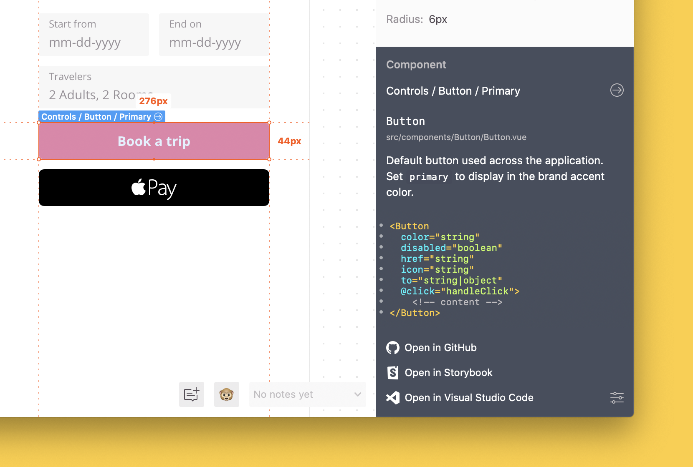

### Table of Contents
- [Getting started with Vue.js](#getting-started-with-vuejs)
  * [1. Prepare configuration file](#1-prepare-configuration-file)
    + [Create configuration file](#create-configuration-file)
      - [Manual configuration](#manual-configuration)
      - [Using VS Code Extension](#using-vs-code-extension)
    + [Add projects or styleguides](#add-projects-or-styleguides)
      - [Manual configuration](#manual-configuration-1)
      - [Using VS Code Extension](#using-vs-code-extension-1)
    + [Add component from codebase](#add-component-from-codebase)
      - [Manual configuration](#manual-configuration-2)
      - [Using VS Code Extension](#using-vs-code-extension-2)
    + [Connect to component from Zeplin](#connect-to-component-from-zeplin)
      - [Manual configuration](#manual-configuration-3)
      - [Using VS Code Extension](#using-vs-code-extension-3)
  * [2. Install Zeplin CLI](#2-install-zeplin-cli)
  * [3. Install CLI Vue.js plugin](#3-install-cli-vuejs-plugin)
  * [4. Run Zeplin CLI](#4-run-zeplin-cli)
  * [5. Add links _(Optional)_](#5-add-links-optional)
  * [6. Connect more components](#6-connect-more-components)
- [Troubleshooting](#troubleshooting)
- [Related resources](#related-resources)

# Getting started with Vue.js

This guide covers how to get started with Connected Components for Vue.js components.

> **👀 We simplified the Connected Components experience, you can now get it running within minutes. [Check this document for details.](./INITIALIZE.md)**

## 1. Prepare configuration file

The first thing we'll do is to create a JSON configuration file in our repository that maps components in our codebase to the components in Zeplin.

You can either prepare the configuration file:

- Manually
- Use [Zeplin Visual Studio Code extension](https://zpl.io/vscode-extension) _(Recommended)_

In this guide, we'll prepare the file manually, while also mentioning how you can use the extension to simplify all of the steps.

### Create configuration file

#### Manual configuration

We recommend creating your Zeplin configuration file under the `.zeplin` folder in your repository, so let's create that folder first. Within the folder, also create a file called `components.json` and paste the JSON below:

```json
{
    "projects": [],
    "styleguides": [],
    "components": []
}
```

#### Using VS Code Extension

If you use the Visual Studio Code extension, it should prompt you to create the configuration file. You can also use the “Create Zeplin Configuration File” command by pressing “Command/Ctrl + Shift + P”. After creating the configuration file, make sure to click the “Login” link on top of the file to authenticate with your Zeplin account.

In a bit, we'll start filling out the configuration file:

- `projects` and `styleguides` keys are the identifiers of projects and styleguides we'll use components from.
- `components` are the Vue.js component files in our codebase.

### Add projects or styleguides

#### Manual configuration

Now, let's add Zeplin projects or styleguides to the configuration file. If you're using [Global Styleguides](https://blog.zeplin.io/announcing-global-styleguides-connecting-design-systems-to-engineering-65ad22bd0076), adding your styleguide(s) will be enough. If instead your components are under projects, you can add all your projects as well. In this example, we'll only add one styleguide.

To add projects or styleguides, we need their identifiers. If you're not using the Visual Studio Code extension, the easiest way to find the identifier of a Zeplin project or a styleguide is to open them in Zeplin's [Web app](https://app.zeplin.io). Look for the URL in the address bar, which should look like so: `https://app.zeplin.io/styleguide/5cd486b18a64c1414be004fb`. The identifier after `styleguide/` (or `project/`) is the identifier we're looking for.

#### Using VS Code Extension

If you're using the Visual Studio Code extension, simply click “Add styleguide” or “Add project” and you'll be presented with a list.

After adding projects or styleguides to our configuration file, it should look like so:

```json
{
    "projects": [],
    "styleguides": [
        "5cd486b18a64c1414be004fb"
    ],
    "components": []
}
```

☝️ _If you have a styleguide tree and want to connect to all the components in the tree, adding a child styleguide to the configuration should be enough._

### Add component from codebase

#### Manual configuration

Adding a component from your codebase to the configuration file is pretty straightforward—we'll add an object to the `components` list.

In this example, we'll go with a `Button.vue` file under `src/components`. Pick a reusable Vue.js component file from your codebase and let's update our configuration file to look like so:

```json
{
    "projects": [],
    "styleguides": [
        "5cd486b18a64c1414be004fb"
    ],
    "components": [
        {
            "path": "src/components/Button.vue",
            "zeplinIds": []
        }
    ]
}
```

#### Using VS Code Extension

If you're using the Visual Studio Code extension, click the “Add component” link which will list all the files in your repository. Pick the one you want and your configuration file should look like the below example.

```json
{
    "projects": [],
    "styleguides": [
        "5cd486b18a64c1414be004fb"
    ],
    "components": [
        {
            "path": "src/components/Button.vue",
            "zeplinIds": []
        }
    ]
}
```

Next up, we'll populate the `zeplinIds` key.

### Connect to component from Zeplin

It is recommended to use [Zeplin CLI initialize flow](./INITIALIZE.md) or use VS Code Extension to add `zeplinIds` into the configuration file.

#### Manual configuration

> **Using `zeplinNames` is deprecated in favor of `zeplinIds`. If you are looking for the older guide check out [here](https://github.com/zeplin/connected-components-docs/blob/3784a60ef460792fd9df8476986fea58bfc9e7fe/docs/gettingStarted/VUE.md).**

Now it's time to connect the Vue component we just added, to a component in Zeplin. We'll do that by adding component ids to the `zeplinIds` list.

Open Zeplin's [Web app](https://app.zeplin.io) and navigate to the component you want to connect. Select the component and look for the URL in the address bar, which should look like: `https://app.zeplin.io/styleguide/5dd4166f2387f13fc8b27ace/components?coid=5dd41717b4eaa04034df4c6f`. The part after `coid=` is the identifier we're looking for, which is `5dd41717b4eaa04034df4c6f` on the last example.

Let's add this identifier to the `zeplinIds` list:

```json
{
    "projects": [],
    "styleguides": [
        "5cd486b18a64c1414be004fb"
    ],
    "components": [
        {
            "path": "src/components/Button.vue",
            "zeplinIds": [
                "5dd41717b4eaa04034df4c6f"
            ]
        }
    ]
}
```

It's possible connect a component in our codebase to multiple components in Zeplin—let's do that:

```json
{
    "projects": [],
    "styleguides": [
        "5cd486b18a64c1414be004fb"
    ],
    "components": [
        {
            "path": "src/components/Button.vue",
            "zeplinIds": [
                "5dd4171a6825f144e068f1c6",
                "5dd41717b4eaa04034df4c6f",
                "602f60b5dd16708b272ace28"
            ]
        }
    ]
}
```

#### Using VS Code Extension

If you're using the Visual Studio Code extension, you can simply click “Connect to Zeplin component” and search for a component in Zeplin, directly within Visual Studio Code.

Next up, we'll install and use Zeplin's CLI tool so that these connected components are visible in Zeplin to our team.

## 2. Install Zeplin CLI

Zeplin CLI runs in your terminal and communicates the configuration file with Zeplin.

Let's start by installing it. Zeplin CLI runs on Node.js, if you don't have it installed already, see [Node.js website](https://nodejs.org/en/).

To install Zeplin CLI from npm, run the following command on your Terminal/Command Prompt:

```sh
npm install -g @zeplin/cli

# Or install locally as devDependency

npm install -D @zeplin/cli
```

## 3. Install CLI Vue.js plugin

Zeplin CLI uses plugins to generate documentation, snippets and links from components—check out our [list of plugins](/README.md#Plugins).

Since we're using Vue.js, we'll install the Vue.js plugin (developed by the fine folks at [politico](https://github.com/politico)) from npm, by running the following command:

```sh
npm install -g zeplin-cli-connect-plugin-vue

# Or install locally as devDependency

npm install -D zeplin-cli-connect-plugin-vue
```

Now, we'll update our configuration file to use the plugin. We can do that by adding it under the `plugins` list, like so:

```json
{
    "plugins": [
        {
            "name": "zeplin-cli-connect-plugin-vue"
        }
    ],
    "projects": [],
    "styleguides": [
        "5cd486b18a64c1414be004fb"
    ],
    "components": [
        {
            "path": "src/components/Button.vue",
            "zeplinIds": [
                "5dd41717b4eaa04034df4c6f"
            ]
        }
    ]
}
```

Next up, we'll run the CLI command!

## 4. Run Zeplin CLI

It's time! Let's **run the CLI command and see Connected Components in action** within Zeplin. 🎉

Run the following command—if it's your first time, you'll need to login to Zeplin first:

```sh
zeplin connect
```

If **@zeplin/cli** and the plugin is locally installed, add a `zeplin connect` script on **package.json**:

```jsonc
{
    ...
    "scripts": {
        ...
        "zeplin-connect": "zeplin connect"
        ...
    }
    ...
}
```

Run the script:
```sh
npm run zeplin-connect
```

Now head back to Zeplin and click on one of the components you connected. You should see an output similar to this:



**Congratulations, we just connected our first component!** 🎉

For further information on how components are analyzed by the Vue.js plugin, check out the [repository](https://github.com/politico/zeplin-cli-connect-plugin-vue).

☝️ _If you want to see the output locally in Zeplin before you publish it to your team, check out our guide on [testing your changes locally](TEST_LOCALLY.md)._

## 5. Add links _(Optional)_

Connected Components also lets you add links to various sources like your Storybook, repository, wiki and so on. In the screenshot above, notice that we have links to GitHub and Storybook.

To add links to your components, check out these guides:

- [Adding Storybook links](../link/STORYBOOK.md)
- [Adding Styleguidist links](../link/STYLEGUIDIST.md)
- [Adding repository links](../link/REPOSITORY.md), e.g. GitHub, GitLab, Bitbucket
- [Adding custom links](../link/CUSTOM.md), e.g. internal Design System wiki

## 6. Connect more components

Now that we connected our very first component, you can go ahead and connect more! Check out the section [Add component from codebase](#add-component-from-codebase) if you need any help.

Hope this getting started guide was helpful, reach out to us at [support@zeplin.io](mailto:support@zeplin.io) if you have any questions or feedback.

For further details on how to customize the configuration file, check out the [Configuration file documentation](../CONFIGURATION_FILE.md).

# Troubleshooting

If you run into any issues while running the `zeplin connect` command, make sure that you have the Vue.js plugin installed.

If you can't see documentation or code snippets in Zeplin after you successfully run the command, please create an issue under the [Vue.js plugin repository](https://github.com/politico/zeplin-cli-connect-plugin-vue/issues).

Check out [Troubleshooting](../TROUBLESHOOTING.md) for other common issues.

# Related resources

- [Vue.js Plugin](https://github.com/politico/zeplin-cli-connect-plugin-vue)
- [Configuration file documentation](../CONFIGURATION_FILE.md)
- [Plugins](/README.md#Plugins)
- [Build your own plugin](https://github.com/zeplin/cli/blob/master/PLUGIN.md)
