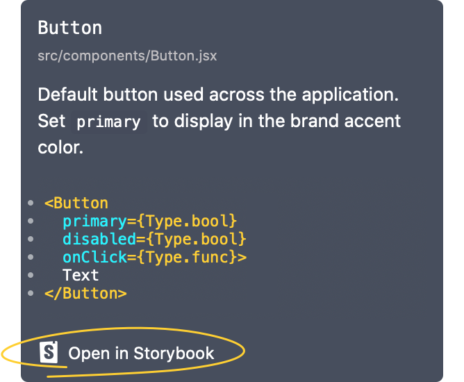

# Adding Storybook links

In this guide, we'll talk about how to add Storybook links to components. This lets you quickly access stories of your components within Zeplin, as you use them.

☝️ _If you haven't created a Connected Components configuration file yet, check out our [getting started guides](../../README.md#getting-started)._

## Install CLI Storybook plugin

Similar to how we installed plugins based on our platform/framework in our getting started guide, let's install the Storybook plugin as well, by running the following command:

```sh
npm install -g @zeplin/cli-connect-storybook-plugin
```

Alternatively, if you're using npm in your project, you can add it as a `devDependency`.

## Setup Storybook plugin

Now, let's add the plugin to our configuration file and set it up. Since Zeplin requires a running Storybook instance to collect information about stories, the setup will be different based on whether you use a local or a remote Storybook instance.

### Local Storybook instance

If you use Storybook locally, we'll provide Zeplin the npm script (or the command) to start a Storybook instance. Let's add the plugin to our configuration file under the `plugins` list, provide the local URL and a command like so:

```json
{
    "plugins": [
        …
        {
            "name": "@zeplin/cli-connect-storybook-plugin",
            "config": {
                "url": "http://localhost:9009",
                "startScript": "storybook",
            }
        }
    ],
    …
}
```

☝️ _Make sure to update the npm script name or the port of the URL, if yours are different._

If you run Storybook using a command instead, you can use the `command` property instead of the `startScript` property.

### Remote Storybook insteance

If you have a Storybook instance that's running remotely, let's add the plugin to our configuration file under the `plugins` list, providing the URL like so:

```json
{
    "plugins": [
        …
        {
            "name": "@zeplin/cli-connect-storybook-plugin",
            "config": {
                "url": "https://storybook.example.net"
            }
        }
    ],
    …
}
```

## Match components with stories

Storybook plugin does most of the heavylifting for us by automatically attempting to match stories with components in our configuration file—let's look at how it works.

Here's our sample configuration file with two components:

```json
{
    …
    "components": [
        {
            "path": "src/components/Button/Button.js",
            "zeplinNames": [
                "Controls / Button / Primary"
            ]
        },
        {
            "path": "src/components/TextField/TextField.js",
            "zeplinNames": [
                "Controls / Text field / Primary"
            ]
        }
    ]
}
```

If you're using React, Storybook plugin will go through all the stories and find the ones that include the components in our configuration file. In the example above, Zeplin will automatically display links to stories that use the `Button` and `TextField` components.

Otherwise, Storybook plugin will attempt to match the `component` properties of stories (either for [`storiesOf` API](https://storybook.js.org/docs/formats/storiesof-api/) or [Component Story Format](https://storybook.js.org/docs/formats/component-story-format/)) with the file names of the components in our configuration file. In the example above, Zeplin will automatically display links to stories with `component` properties set to `Button` or `TextField`.

Finally, Storybook plugin will attempt to match the display names of stories with the components names in our configuration file. In the example above, Zeplin will automatically display links to stories with display name set to “Button”, “TextField”, “Design System/Button”, “Design System/TextField” and so on.

If none of these options work for you, it's also possible to manually match components with their stories. To demonstrate this, let's set the `storybook` property for our button component and define the story kind and names, like so:

```json
{
    …
    "components": [
        {
            "path": "src/components/Button/Button.js",
            "zeplinNames": [
                "Controls / Button / Primary"
            ],
            "storybook": {
                "kind": "Design System/Button",
                "stories": [
                    "default",
                    "primary",
                    "with emoji"
                ]
            }
        },
        …
    ]
}
```

☝️ _Let us know at [support@zeplin.io](mailto:support@zeplin.io) if you manually match your components with stories. We'd love to improve the Storybook plugin to support more use cases._

Now when we run `zeplin connect`, we should start seeing the “Open in Storybook” button in Zeplin:



Hope this quick guide on Storybook links was helpful, reach out to us at [support@zeplin.io](mailto:support@zeplin.io) if you have questions or feedback.
