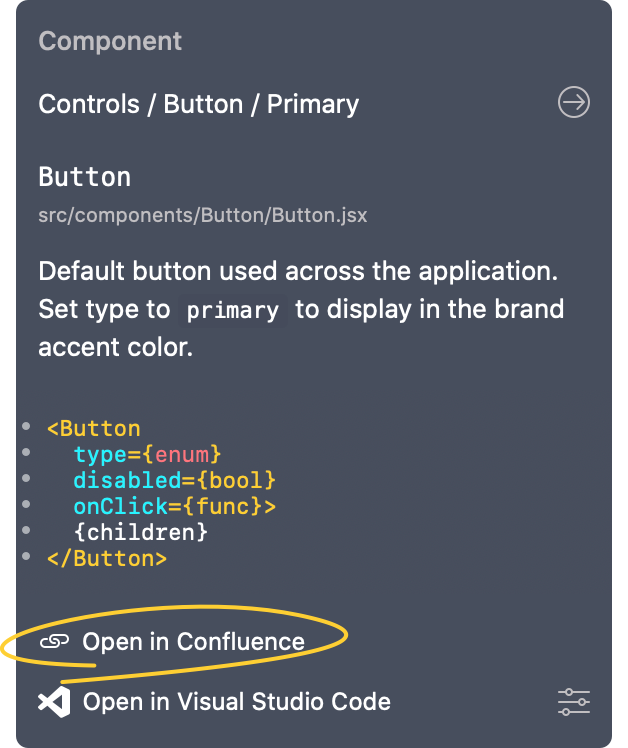

# Adding Styleguidist links

In this guide, we'll talk about how to add Styleguidist links to components. This lets you quickly access your Styleguidist documentation for your components within Zeplin, as you use them.

☝️ _If you haven't created a Connected Components configuration file yet, check out our [getting started guides](../../README.md#getting-started)._

Here's our sample configuration file with two React components:

```json
{
    "plugins": [
        {
            "name": "@zeplin/cli-connect-react-plugin"
        }
    ],
    "projects": [],
    "styleguides": [
        "5cd486b18a64c1414be004fb"
    ],
    "components": [
        {
            "path": "src/components/Button/Button.jsx",
            "zeplinNames": [
                "Controls / Button / Primary"
            ]
        },
        {
            "path": "src/components/TextField/TextField.jsx",
            "zeplinNames": [
                "Controls / Text field / Primary"
            ]
        }
    ]
}
```

Firstly, in our configuration file, we'll add a property called `links`. `links` property is a list that can hold multiple links but for now we'll only define our Styleguidist link:

```json
{
    …
    "components": [
        …
    ],
    "links": [
        {
            "name": "Styleguidist",
            "type": "styleguidist",
            "url": "https://example.net/styleguidist"
        }
    ]
}
```

While defining the link, we need to provide 3 properties:

1. `name` property is the name for the link that'll be displayed in Zeplin. In this case, we put in “Styleguidist” so that the button in Zeplin would say “Open in Styleguidist”.
2. `type` property is the identifier, which we'll set to `styleguidist`.
3. `url` property is where we specify the URL for our Styleguidist instance. Note that this can either be a localhost URL or a remote URL.

Let's now define the Styleguidist names for the two components in our configuration file. To do that, under each component, we'll add a property called `styleguidist`. Finally, within this property, we'll define the the name under the `kind` property, like so:

```json
{
    …
    "components": [
        {
            "path": "src/components/Button/Button.jsx",
            "zeplinNames": [
                "Controls / Button / Primary"
            ],
            "styleguidist": {
                "kind": "button"
            }
        },
        {
            "path": "src/components/TextField/TextField.jsx",
            "zeplinNames": [
                "Controls / Text field / Primary"
            ],
            "styleguidist": {
                "kind": "textfield"
            }
        }
    ],
    "links": [
        {
            "name": "Styleguidist",
            "type": "styleguidist",
            "url": "https://example.net/styleguidist"
        }
    ]
}
```

This lets Zeplin concatenate the name to the URL. So for the button component, the complete URL ends up being `https://example.net/styleguidist#markdown`.

This is it! Now when we run `zeplin connect`, we should start seeing the “Open in Styleguidist” button in Zeplin:

 _<TODO: Update screenshot.>_

Hope this quick guide on Styleguidist links was helpful, reach out to us at [support@zeplin.io](mailto:support@zeplin.io) if you have questions or feedback.
